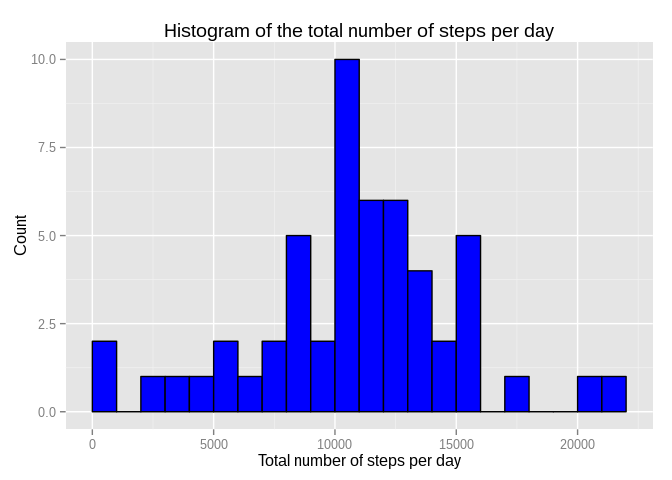
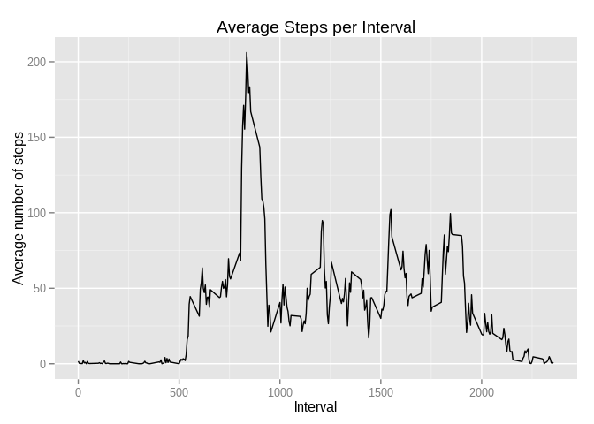
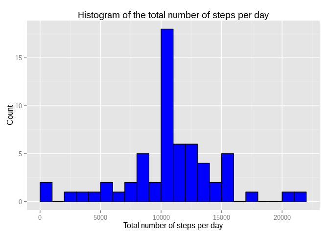
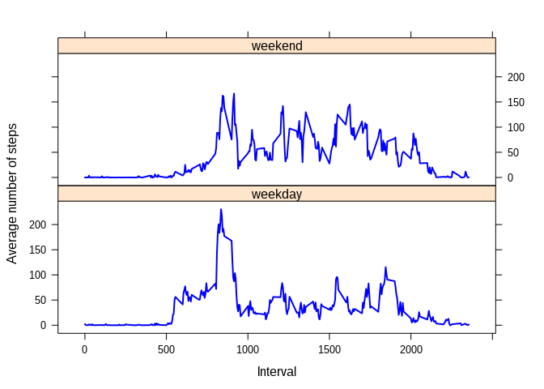

# Reproducible Research: Peer Assessment 1


## Loading and preprocessing the data

> Show any code that is needed to  
 1. Load the data (i.e. read.csv())  
 2. Process/transform the data (if necessary) into a format suitable for your analysis


```r
    zip.name <- "activity.zip"
    file.name <- "activity.csv"
    unzip(zip.name)
    activity <- read.csv(file.name, header = TRUE, stringsAsFactors = FALSE, na.strings = "NA")
```

Summary of the data set


```r
    str(activity)
```

```
## 'data.frame':	17568 obs. of  3 variables:
##  $ steps   : int  NA NA NA NA NA NA NA NA NA NA ...
##  $ date    : chr  "2012-10-01" "2012-10-01" "2012-10-01" "2012-10-01" ...
##  $ interval: int  0 5 10 15 20 25 30 35 40 45 ...
```

```r
    activity$date <- as.Date(activity$date)
    head(activity)
```

```
##   steps       date interval
## 1    NA 2012-10-01        0
## 2    NA 2012-10-01        5
## 3    NA 2012-10-01       10
## 4    NA 2012-10-01       15
## 5    NA 2012-10-01       20
## 6    NA 2012-10-01       25
```

```r
    summary(activity)
```

```
##      steps             date               interval     
##  Min.   :  0.00   Min.   :2012-10-01   Min.   :   0.0  
##  1st Qu.:  0.00   1st Qu.:2012-10-16   1st Qu.: 588.8  
##  Median :  0.00   Median :2012-10-31   Median :1177.5  
##  Mean   : 37.38   Mean   :2012-10-31   Mean   :1177.5  
##  3rd Qu.: 12.00   3rd Qu.:2012-11-15   3rd Qu.:1766.2  
##  Max.   :806.00   Max.   :2012-11-30   Max.   :2355.0  
##  NA's   :2304
```

## What is mean total number of steps taken per day?

> For this part of the assignment, you can ignore the missing values in the dataset.  
1. Make a histogram of the total number of steps taken each day  
2. Calculate and report the mean and median total number of steps taken per day  


```r
    stepsDay <- aggregate(steps ~ date, activity, sum, na.action = na.omit)
```


```r
    p <- ggplot(stepsDay, aes(steps)) + geom_histogram(breaks=seq(0, max(stepsDay$steps) + 1000, by = 1000), colour="black", fill="blue")
    p <- p + labs(title="Histogram of the total number of steps per day")
    p <- p + labs(x="Total number of steps per day", y="Count") 
    print(p)
```

 


```r
    mean(stepsDay$steps)
```

```
## [1] 10766.19
```

```r
    median(stepsDay$steps)
```

```
## [1] 10765
```
## What is the average daily activity pattern?

> 1. Make a time series plot (i.e. type = "l") of the 5-minute interval (x-axis) and the average number of steps taken, averaged across all days (y-axis)  
2. Which 5-minute interval, on average across all the days in the dataset, contains the maximum number of steps?


```r
    avg_StepsInterval <- aggregate(steps ~ interval, activity,mean, na.action = na.omit)
```


```r
    p <- ggplot(avg_StepsInterval, aes(x=interval, y=steps)) + geom_line()
    p <- p + labs(title="Average Steps per Interval")
    p <- p + labs(x="Interval", y="Average number of steps") 
    print(p)
```

 


```r
    max_row <- subset(avg_StepsInterval, steps >= max(steps))
    max_row
```

```
##     interval    steps
## 104      835 206.1698
```


## Imputing missing values

> Note that there are a number of days/intervals where there are missing values (coded as NA). The presence of missing days may introduce bias into some calculations or summaries of the data.  
1. Calculate and report the total number of missing values in the dataset (i.e. the total number of rows with NAs)  
2. Devise a strategy for filling in all of the missing values in the dataset. The strategy does not need to be sophisticated. For example, you could use the mean/median for that day, or the mean for that 5-minute interval, etc.  
3. Create a new dataset that is equal to the original dataset but with the missing data filled in.  
4. Make a histogram of the total number of steps taken each day and Calculate and report the mean and median total number of steps taken per day. Do these values differ from the estimates from the first part of the assignment? What is the impact of imputing missing data on the estimates of the total daily number of steps?  


```r
    nof_NA <- sum(is.na(activity))
    print(nof_NA)
```

```
## [1] 2304
```


```r
    activity_no_NA <- activity
    activity_no_NA[is.na(activity_no_NA), 'steps']  <- tapply(activity_no_NA$steps,activity_no_NA$interval,FUN=mean,na.rm=TRUE)
    head(activity_no_NA)
```

```
##       steps       date interval
## 1 1.7169811 2012-10-01        0
## 2 0.3396226 2012-10-01        5
## 3 0.1320755 2012-10-01       10
## 4 0.1509434 2012-10-01       15
## 5 0.0754717 2012-10-01       20
## 6 2.0943396 2012-10-01       25
```


```r
    stepsDay_no_NA <- aggregate(steps ~ date, activity_no_NA, sum, na.action = na.omit)
```


```r
    p <- ggplot(stepsDay_no_NA, aes(steps)) + geom_histogram(breaks=seq(0, max(stepsDay_no_NA$steps) + 1000, by = 1000), colour="black", fill="blue")
    p <- p + labs(title="Histogram of the total number of steps per day")
    p <- p + labs(x="Total number of steps per day", y="Count") 
    print(p)
```

 


```r
    mean(stepsDay_no_NA$steps)
```

```
## [1] 10766.19
```

```r
    median(stepsDay_no_NA$steps)
```

```
## [1] 10766.19
```

The missing values cause small changes from the previous estimations, where the missing values have been ignored.


## Are there differences in activity patterns between weekdays and weekends?

> For this part the weekdays() function may be of some help here. Use the dataset with the filled-in missing values for this part.  
1. Create a new factor variable in the dataset with two levels -- "weekday" and "weekend" indicating whether a given date is a weekday or weekend day.  
2. Make a panel plot containing a time series plot (i.e. type = "l") of the 5-minute interval (x-axis) and the average number of steps taken, averaged across all weekday days or weekend days (y-axis). The plot should look something like the following, which was created using simulated data:  


```r
    weekdayNames <- c("Monday", "Tuesday", "Wednesday", "Thursday", 
    "Friday")
    activityWeek <- activity_no_NA
    activityWeek$weekdayType <- sapply(activityWeek$date, FUN=function(day) {
        if(weekdays(day) %in% weekdayNames)
            day <- "weekday"
        else
            day <- "weekend"
    })
    activityWeek$weekdayType <- as.factor(activityWeek$weekdayType)
    str(activityWeek)
```

```
## 'data.frame':	17568 obs. of  4 variables:
##  $ steps      : num  1.717 0.3396 0.1321 0.1509 0.0755 ...
##  $ date       : Date, format: "2012-10-01" "2012-10-01" ...
##  $ interval   : int  0 5 10 15 20 25 30 35 40 45 ...
##  $ weekdayType: Factor w/ 2 levels "weekday","weekend": 1 1 1 1 1 1 1 1 1 1 ...
```

```r
    head(activityWeek)
```

```
##       steps       date interval weekdayType
## 1 1.7169811 2012-10-01        0     weekday
## 2 0.3396226 2012-10-01        5     weekday
## 3 0.1320755 2012-10-01       10     weekday
## 4 0.1509434 2012-10-01       15     weekday
## 5 0.0754717 2012-10-01       20     weekday
## 6 2.0943396 2012-10-01       25     weekday
```


```r
    avg_stepsWeekdays <- aggregate(steps ~ interval + weekdayType, activityWeek, mean)
```


```r
    xyplot(steps ~ interval | weekdayType, data=avg_stepsWeekdays, layout = c(1, 2),
       col = "blue", xlab = "Interval", ylab = "Average number of steps", 
       type = "l", lwd = 2)
```

 


